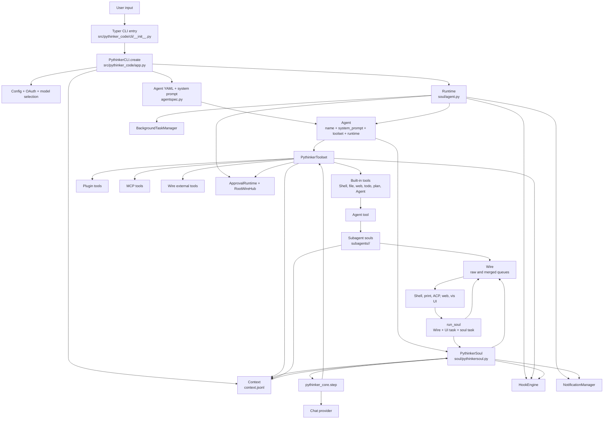
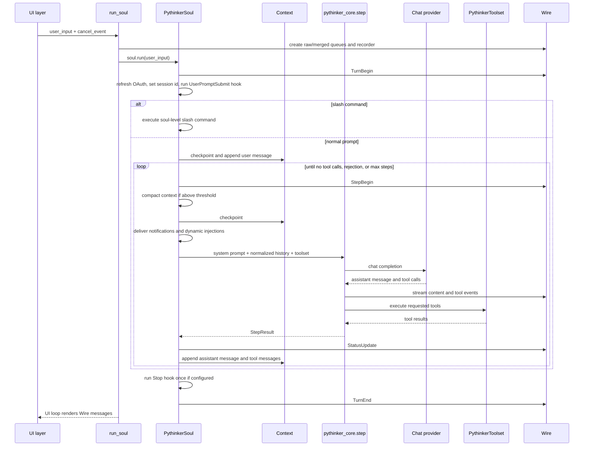
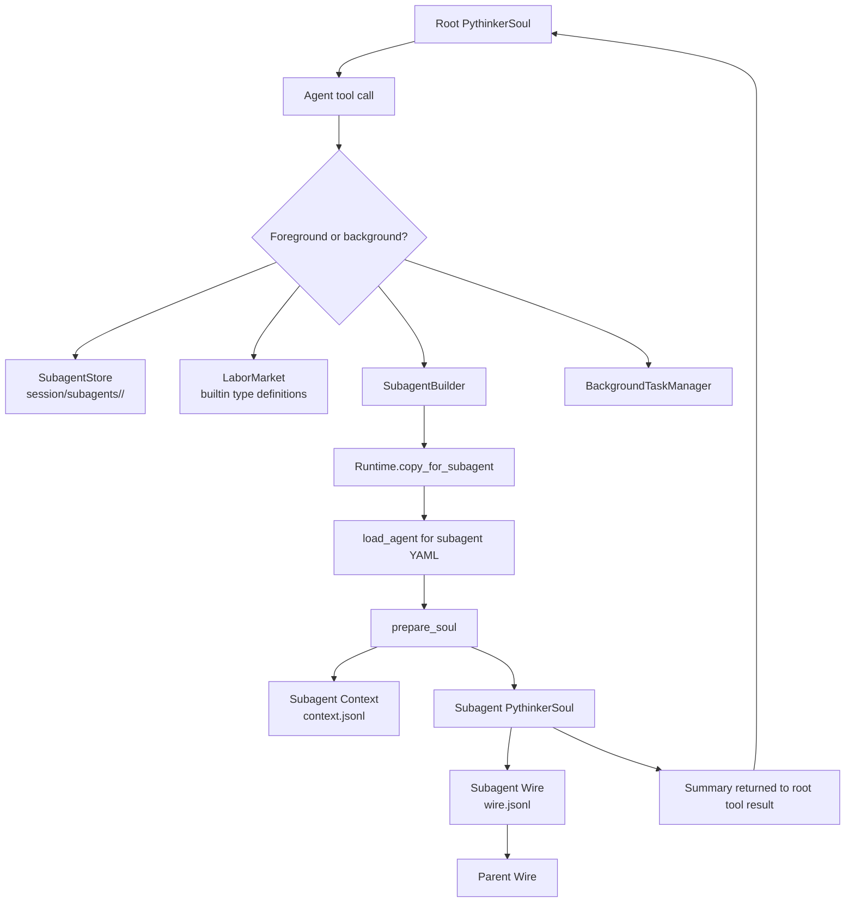
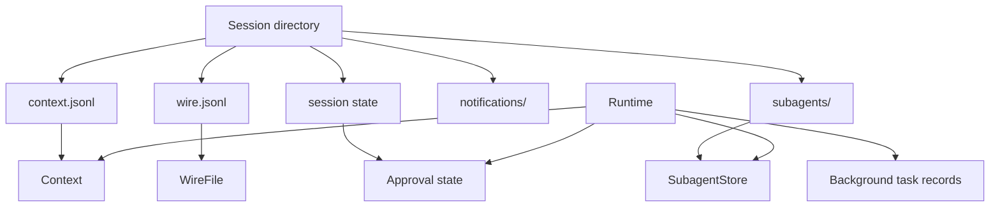

# Agent Architecture

Pythinker Code is organized around a small agent runtime called the soul. The CLI and UI layers prepare a `Runtime`, load an agent specification, restore persisted conversation context, then hand each user prompt to `PythinkerSoul`. During a turn, the soul repeatedly calls the LLM through `pythinker_core.step`, streams Wire events to the active UI, executes tool calls through `PythinkerToolset`, and appends the assistant and tool messages back into `Context` until the model stops requesting tools.

This page maps the agent architecture from the code tree so the same graph can later be exported as an image.

## Source map

The main files involved in the agent loop are:

| Area | Files | Responsibility |
|------|-------|----------------|
| CLI assembly | `src/pythinker_code/app.py`, `src/pythinker_code/cli/__init__.py` | Load config, select model/provider, create runtime, load agent, restore context, connect UI |
| Agent definition | `src/pythinker_code/agentspec.py`, `src/pythinker_code/soul/agent.py`, `src/pythinker_code/agents/*/agent.yaml` | Resolve agent YAML, render system prompts, register tools and subagent types |
| Main loop | `src/pythinker_code/soul/pythinkersoul.py`, `src/pythinker_code/soul/__init__.py` | Run turns and steps, call LLM, handle slash commands, compaction, steers, hooks, D-Mail, status |
| Conversation storage | `src/pythinker_code/soul/context.py` | Persist system prompt, user messages, assistant messages, tool messages, usage records, checkpoints |
| Tool orchestration | `src/pythinker_code/soul/toolset.py`, `src/pythinker_code/tools/` | Load and execute built-in, plugin, MCP, and Wire external tools |
| Wire transport | `src/pythinker_code/wire/` | Stream typed events between soul and UI, persist `wire.jsonl`, bridge subagent events |
| Subagents | `src/pythinker_code/tools/agent/`, `src/pythinker_code/subagents/` | Launch, resume, persist, and summarize isolated subagent souls |
| UI frontends | `src/pythinker_code/ui/shell/`, `src/pythinker_code/ui/print/`, `src/pythinker_code/acp/` | Convert user input into soul turns and render Wire events |
| Runtime services | `src/pythinker_code/approval_runtime/`, `src/pythinker_code/background/`, `src/pythinker_code/hooks/`, `src/pythinker_code/notifications.py` | Approvals, background work, hook execution, out-of-turn notifications |

## Component graph



The graph has two important boundaries. `PythinkerSoul` owns the turn and step lifecycle, but delegates actual LLM/tool orchestration to `pythinker_core.step`. `Wire` owns presentation and persistence of runtime events, so the same soul can be rendered by shell mode, print mode, ACP, web, visualization, or Wire mode.

## Startup graph

Startup creates all long-lived objects before a user turn begins.

```mermaid
flowchart TD
  Start[CLI command starts]
  LoadConfig[Load config]
  OAuth[Create OAuthManager]
  Model[Resolve active LLM model and provider]
  CreateLLM[create_llm]
  RuntimeCreate[Runtime.create]
  Workspace[Scan work dir, AGENTS.md, skills, environment]
  RuntimeServices[Build approvals, notifications, background tasks, subagent store, RootWireHub]
  LoadAgent[load_agent]
  Spec[Resolve agent spec and inherited YAML]
  Prompt[Render system prompt template]
  SubagentTypes[Register builtin subagent types in LaborMarket]
  Toolset[Build PythinkerToolset]
  ToolDeps[Inject Runtime and service dependencies into tools]
  PluginMCP[Load plugin tools and MCP tools]
  Restore[Restore Context from context.jsonl]
  PersistPrompt[Persist or reuse system prompt]
  Soul[Create PythinkerSoul]
  HookEngine[Create HookEngine and attach to soul/runtime/toolset]
  Ready[Ready for turns]

  Start --> LoadConfig --> OAuth --> Model --> CreateLLM --> RuntimeCreate
  RuntimeCreate --> Workspace --> RuntimeServices --> LoadAgent
  LoadAgent --> Spec --> Prompt --> SubagentTypes --> Toolset --> ToolDeps --> PluginMCP
  PluginMCP --> Restore --> PersistPrompt --> Soul --> HookEngine --> Ready
```



`PythinkerCLI.create` is the composition root. It constructs the model and runtime, calls `load_agent`, restores `Context`, creates `PythinkerSoul`, then attaches hooks and telemetry. `Runtime.create` gathers workspace inputs for the system prompt and creates shared session services. `load_agent` renders the agent prompt, registers subagent type definitions, builds the toolset, and loads plugin and MCP tools.

## Turn and step loop

A turn is one user prompt. A step is one LLM call plus any tool calls requested by that LLM response. A turn may contain many steps.



`PythinkerSoul.run` is responsible for turn-level controls: OAuth freshness, prompt submit hooks, slash command dispatch, optional Ralph Loop execution, the Stop hook, and cleanup of approval requests if the turn exits early.

`PythinkerSoul._agent_loop` is responsible for step-level controls. It starts deferred MCP loading, enforces `max_steps_per_turn`, emits `StepBegin`, runs automatic compaction, creates checkpoints, executes `_step`, consumes queued steers, and handles D-Mail rewind by restoring an earlier checkpoint and injecting a future-self message.

`PythinkerSoul._step` builds the effective prompt context for one LLM call. It delivers pending notifications, adds dynamic system reminders as user messages, normalizes adjacent user messages, calls `pythinker_core.step`, records usage with `StatusUpdate`, waits for tool results, and appends the assistant and tool messages to `Context`.

## Tool execution graph

```mermaid
flowchart LR
  Core[pythinker_core.step]
  Call[ToolCall]
  Toolset[PythinkerToolset.handle]
  Parse[Parse JSON arguments]
  Pre[PreToolUse hooks]
  Execute[tool.call(arguments)]
  Builtin[Built-in tool]
  Plugin[Plugin tool]
  MCP[MCP tool wrapper]
  External[WireExternalTool]
  Approval[Approval request if tool requires it]
  Post[PostToolUse or PostToolUseFailure hooks]
  Telemetry[Telemetry]
  Result[ToolResult]
  Context[tool_result_to_message -> Context]
  Wire[Wire event stream]

  Core --> Call --> Toolset --> Parse --> Pre --> Execute
  Execute --> Builtin
  Execute --> Plugin
  Execute --> MCP
  Execute --> External
  Builtin --> Approval
  External --> Wire
  MCP --> Result
  Plugin --> Result
  Builtin --> Result
  Approval --> Result
  Result --> Post --> Telemetry
  Result --> Core
  Result --> Wire
  Result --> Context
```

The toolset is both a registry and an execution boundary. It hides tools from the LLM when needed, validates tool names, parses JSON arguments, triggers hooks, converts exceptions to `ToolRuntimeError`, and returns async `ToolResult` tasks to `pythinker_core.step`. MCP tools are registered as local wrappers. Wire external tools are sent to the active Wire client as `ToolCallRequest` messages and wait for a client-provided result.

## Subagent graph

The `Agent` tool lets only the root agent create or resume subagents. Subagents get isolated context and Wire files, but share session-level services such as approval state, notification infrastructure, background task management, and the root Wire hub.



Foreground subagents run through `ForegroundSubagentRunner`. It creates or resumes a stored instance, prepares a new `PythinkerSoul`, routes subagent Wire events back to the parent as `SubagentEvent`, and returns a summary as the `Agent` tool result. Background subagents are created as background tasks and can notify the root session when complete.

Subagent state is stored under `session/subagents/<agent_id>/`:

| File | Purpose |
|------|---------|
| `meta.json` | Agent ID, type, status, description, model selection, timestamps |
| `context.jsonl` | Isolated conversation history for that subagent |
| `wire.jsonl` | Persisted event stream for that subagent run |
| `prompt.txt` | Last prompt snapshot used to run the subagent |
| `output` | Human-readable status and summary output |

## Runtime state and persistence



`Context` persists conversation state as JSONL records. It stores the system prompt, messages, `_usage` records, and `_checkpoint` records. Checkpoints allow D-Mail and error recovery paths to rewind to a known point. When compaction runs, the context file is rotated, a compacted message set is written, the system prompt is restored, and token counts are updated.

`WireFile` persists a separate JSONL event log for UI/runtime events. It starts with protocol metadata and appends timestamped `WireMessageEnvelope` records. UI code can subscribe to raw or merged Wire queues; the merged queue coalesces streaming content parts before recording or rendering.

## Hook and approval paths

Hooks are integrated at both turn and tool boundaries:

| Hook | Trigger point |
|------|---------------|
| `UserPromptSubmit` | Before a user prompt starts a turn |
| `PreToolUse` | Before a tool executes |
| `PostToolUse` | After a tool succeeds |
| `PostToolUseFailure` | After a tool raises an exception |
| `Stop` | After a turn finishes, with one re-trigger guard |
| `StopFailure` | After an agent step fails |
| `PreCompact` and `PostCompact` | Around context compaction |
| `Notification` | When pending notifications are delivered into LLM context |
| `SubagentStart` and `SubagentStop` | Around foreground subagent execution |

Approvals flow through `ApprovalRuntime`. The runtime binds approval state to `RootWireHub`, so foreground turns, subagents, and background agents can publish approval requests back to the root UI. `PythinkerSoul.run` creates an `ApprovalSource` for each foreground turn and cancels unresolved approvals from that source when the turn exits.

## Stop conditions

A normal turn stops when the latest assistant message contains no tool calls. Other stop paths are:

| Stop path | Behavior |
|-----------|----------|
| Tool rejection without feedback | Root agent stops the turn with `tool_rejected`; subagents continue so they can try alternatives |
| Max step limit | `MaxStepsReached` is raised from `_agent_loop` |
| Step exception | Emits `StepInterrupted`, triggers `StopFailure`, and re-raises |
| Slash command | Executes command and ends the turn without entering the normal step loop |
| D-Mail | Reverts context to a checkpoint, injects a future-self message, then continues stepping |
| Queued steer | Appends follow-up user input and forces another LLM step |

## Mental model

The agent architecture is easiest to read as four concentric layers:

1. `PythinkerCLI.create` is the composition layer. It wires config, model, runtime services, agent spec, context, hooks, and telemetry.
2. `PythinkerSoul` is the lifecycle layer. It owns turns, steps, checkpoints, compaction, slash commands, dynamic injections, and stop conditions.
3. `pythinker_core.step` is the model/tool orchestration layer. It asks the provider for an assistant message, streams output, executes requested tools through the toolset, and exposes tool results back to the soul.
4. `Wire` is the observation layer. It records and broadcasts what happened so shell, print, ACP, web, vis, and external Wire clients can render or control the run without owning agent logic.
